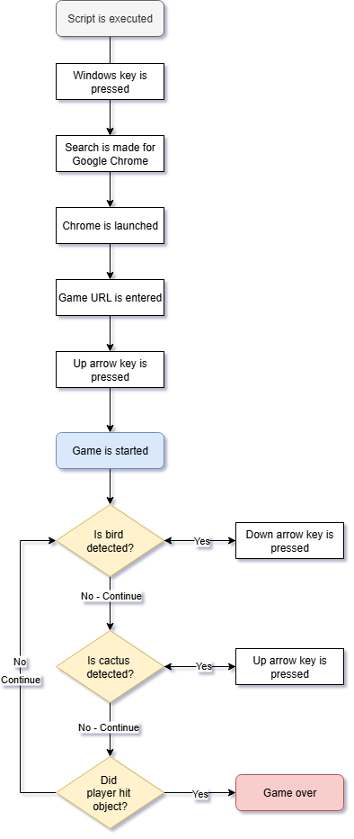

# 100 Days of Code Day 94: Dinosaur Game Automation

## Introduction
Day 94 of the 100 Days of Code Course. The goal for this day of the course was to automate the Google Dinosaur Game.
## Modules Used
### PyAutoGUI
**PyAutoGUI** is used to automate all aspects of this project. That includes opening a new Chrome window and automating the gameplay of the dinosaur game.
### Time
**Time’s sleep method** is used to add a pause between actions when opening a Chrome window.
### Pillow
**Pillow** is used to detect if there is a bird or a cactus in front of the dinosaur during the game. If either is detected, an action is taken to avoid the object.
## Project Files
### Main.py
All the action in this project is accomplished in main.py. The Project Walkthrough section will go into details of the actions taken in the project.
## Project Walkthrough
The script starts by opening a Chrome Window. To accomplish this, the following tasks are completed using PyAutoGUI:
-	The Windows key is pressed
-	In the search bar, “Google Chrome” is searched for and opened.
-	The game's URL is entered in the web search bar

Once the game starts, Pillow is used to detect any changes on the screen as highlighted by the attached screenshot. If there is a change in color in the attached zones, the program takes either of the following actions:
-	If a cactus is detected, the up arrow key is pressed
-	If a bird is detected, the down arrow key is pressed

This loop is executed until the dinosaur collides with a bird or cactus.
## Project Flowchart

